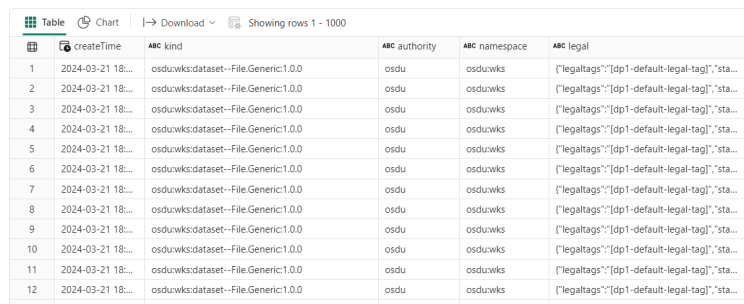

<<<<<<< HEAD
 
# Exposing OSDU/ADME meta data for Analytics and AI use-cases in Azure Fabric

This code example is based on work by Elahe Fazel (Equinor/Capgemini), Jan Mortensen (Equinor), Iman Kheiri(Equinor/Capgemini) and Jon Olav Abeland (Microsoft). 
=======
# Exposing OSDU/ADME meta data for Analytics and AI use-cases in Azure Fabric

This code example is based on work by Elahe Fazel (Equinor/Capgemini), Jan Mortensen (Equinor), Iman Kheiri(Equinor/Capgemini), Jon Olav Abeland (Microsoft) and Eirik Haughom (Microsoft).
>>>>>>> ec7dfa1e746f0ac30dbee908a7a377d9d7fda34d

**OSDU** is an initiative aimed at creating a unified, open-source data platform specifically for the energy industry. OSDU ensures that data can be easily shared and used across different software platforms and tools, reducing the silos that often exist within organizations. 

**ADME** (Azure Data Manager for Energy) is our enterprise grade data platform that combines the reference architecture of the OSDU data platform, Microsoft’s secure and reliable Azure cloud platform, and SLB’s deep domain knowledge.

**Problem statement:** The current search and storage APIs in OSDU are not designed to directly serve Analytics and AI use-cases, but rather classical workflows in the business units.

Microsoft Fabric is an enterprise-grade platform that integrates comprehensive capabilities for Data Movement, Data Science, Real-time Analytics, and Business Intelligence. It is designed to streamline and enhance the entire data lifecycle, enabling organizations to harness the power of analytics and AI effectively.

<<<<<<< HEAD
**Solution:** We suggest therefore to extract the metadata to Microsoft Fabric and use its capabilities to solve AI and Analytics use cases. For a full end to end solutions there are three main steps shown below. **The notebooks linked below will cover the first step.** The last two steps we might release examples for later.

Implementation Steps

1. Extract metadata from OSDU to Microsoft Fabric. (covered by notebooks below)

2. Transform data into facts and dimensions within Fabric.

3. Apply filters, enrichment, and other transformations as required by specific use-cases.

Here is [a notebook to set up delta lake tables neede](/code/ADME_Setup.ipynb). The tables are "run_info" that saves when the code was last run (for delta imports), "main" where all the metadata will be loaded and "logging_info" for logging of errors or information.

Here is [the notebook that will do the export](/code/Fabric_Delta_Export.ipynb). It includes instructions about how to set up config variables and run in your environment. You will of course need to have a running ADME/OSDU platform and a Fabric instance to run the notebook in.

Here is some sample data loaded from ADME (public TNO data set)
There are also some performance tips in the Notebooks (spark settings). 

**Summary:** This blog is an example of how to get started on moving data from OSDU/ADME to Microsoft Fabric in order to support AI and Analytical use cases.

**This is meant as an accelerator and a start for development. It is not production certified code. When the data is moved to Fabric you will have to set up your security regime to handle access to the data.** 

=======
**Solution:** We suggest therefore to extract the metadata to Microsoft Fabric and use its capabilities to solve AI and Analytics use cases.

## Features

This project framework provides the following features:

* [A Pyspark notebook to set up delta lake tables needed and some extra helper code](/code/ADME_Setup.ipynb)
* [A Pyspark notebook that will export ADME meta data to Fabric delta lake tables](/code/Fabric_Delta_Export.ipynb)

## Getting Started

### Prerequisites

- An Azure Fabric instance
- Azure Key Vault
- An Azure Data Manager for Energy instance 

### Installation

- [Use this notebook to set up delta lake tables needed and some extra helper code](/code/ADME_Setup.ipynb)
- [Use this notebook to export ADME meta data to Fabric delta lake tables](/code/Fabric_Delta_Export.ipynb)

### Quickstart
(Add steps to get up and running quickly)

1. git clone https://github.com/Azure-Samples/ADME-Enterprise-Consumption-Zone-on-Fabric.git
2. Copy both notebooks in the code folder to your Fabric environment
3. Open ADME_Setup notebook, fill in the settings as documented in the notebook. Then run the notebook to create the needed tables
4. Open the Fabric_Delta_Export notebook, fill inn the settings as documented and run the notebook. There is one cell that sets a last run date. This is used for delta exports (everything changed since last run). If you want to run all data, then set the last run date back before the ADME instance was created.

## Resources

- We aim to add code to move data from bronze to gold in a medallion structure at a later point
- We aim to add an example of a Power BI dashboard at a later point
>>>>>>> ec7dfa1e746f0ac30dbee908a7a377d9d7fda34d
